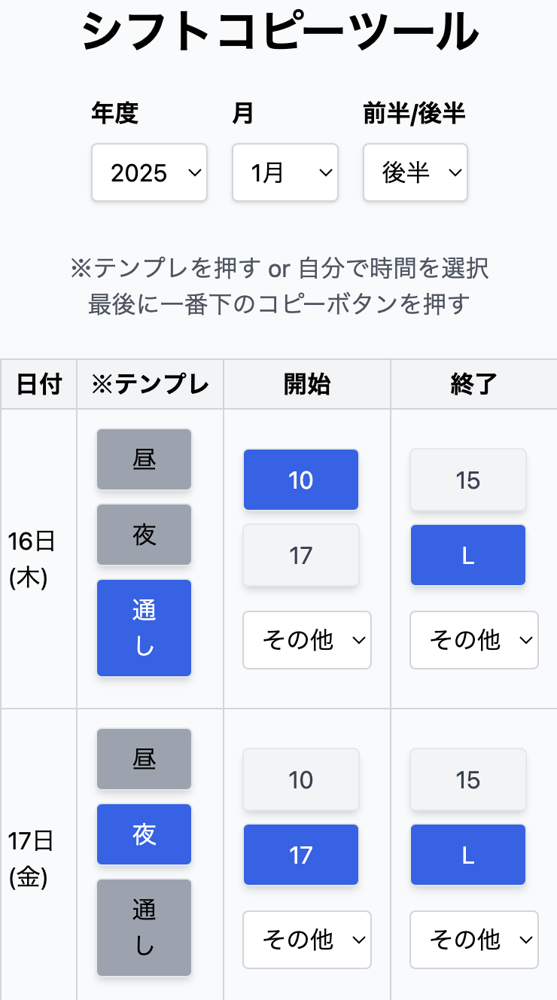

# シフト提出サポートツール

このアプリは、バイト先のシフト提出をサポートするためのツールです。ボタン操作で提出する文章を簡単にコピーできる機能を提供しています。

## 機能

- **年度、月、前半/後半の選択**: シフトを提出する年度、月、前半/後半を選択できます。
- **シフト設定**: 日付ごとにシフトの開始時間と終了時間を設定できます。
- **テンプレートボタン**: よく使うシフト時間をテンプレートとして設定できます。
- **コピー機能**: 設定したシフト情報をボタン一つでクリップボードにコピーできます。
- **コピー完了のポップアップ**: コピーが完了すると、ポップアップで通知されます。

## 使用方法

1. 年度、月、前半/後半を選択します。
2. 各日付のシフト時間を設定します。
3. 必要に応じてテンプレートボタンを使用してシフト時間を設定します。
4. 「コピー」ボタンを押して、設定したシフト情報をクリップボードにコピーします。
5. コピー完了のポップアップが表示されます。

## デプロイ先

アプリは以下のリンクからアクセスできます：
[シフト提出サポートツール](https://shift-tool.vercel.app/)

## スクリーンショット



## 開発者向け情報

このアプリは React と Tailwind CSS を使用して開発されています。開発環境をセットアップするには、以下の手順に従ってください。

### セットアップ

1. リポジトリをクローンします。
   ```bash
   git clone https://github.com/yourusername/shift-tool.git
   cd shift-tool
   ```
